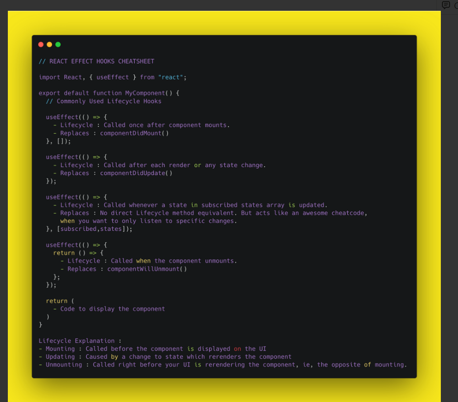
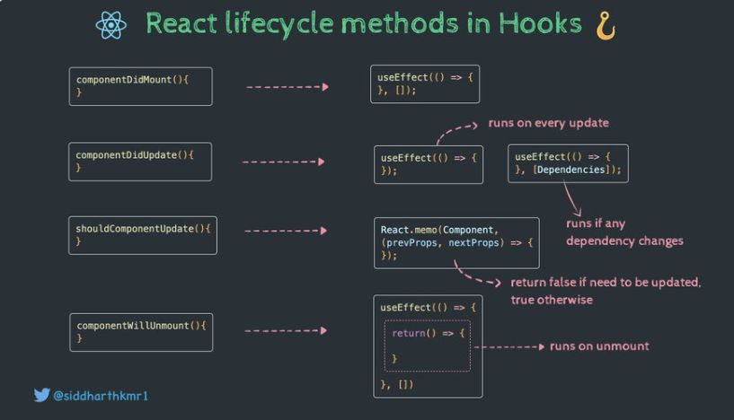
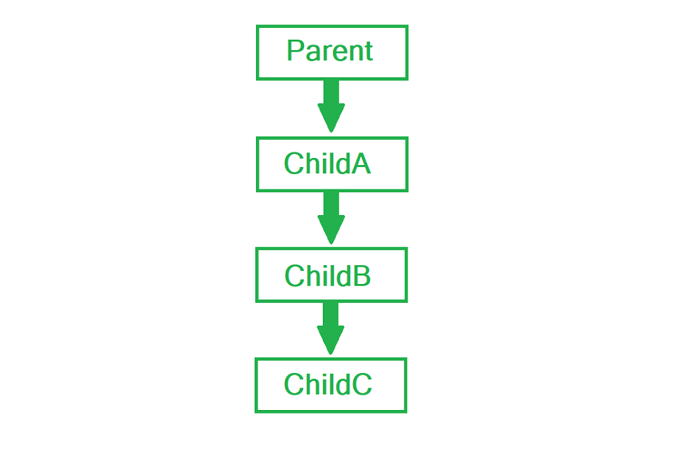
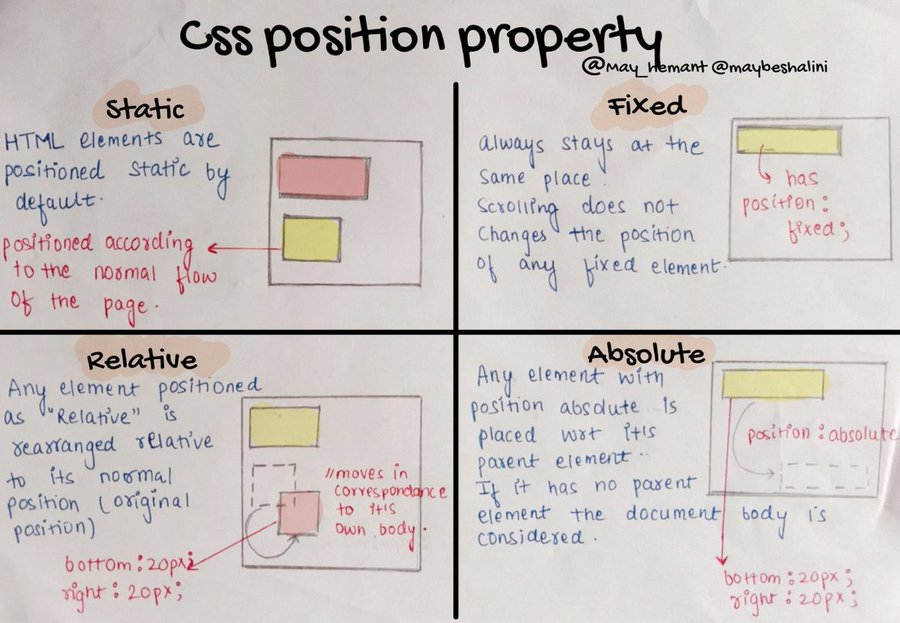
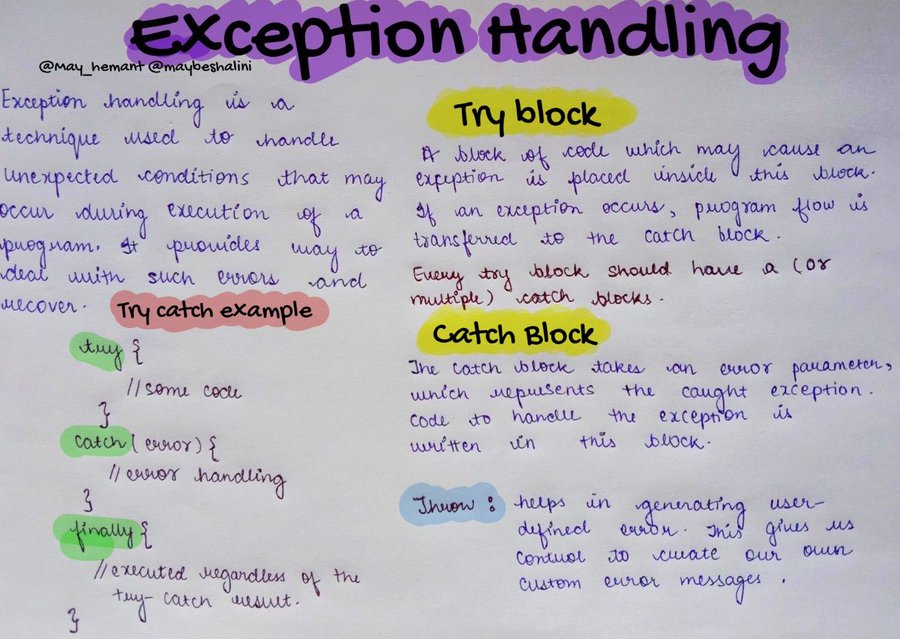
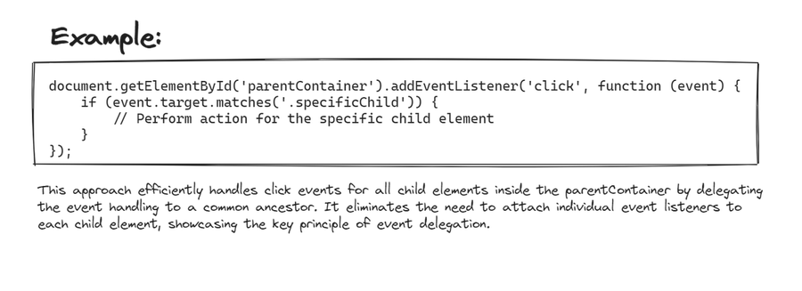

# Table of contents

| No. | Questions                                                                                                                                                                                                                                                                                 |
| --- | ----------------------------------------------------------------------------------------------------------------------------------------------------------------------------------------------------------------------------------------------------------------------------------------- |
| 1   | [What is the closure](#what-is-the-closure)                                                                                                                                                                                                                                               |
| 2   | [What is a callback Function?](#what-is-a-callback-function)                                                                                                                                                                                                                              |
| 3   | [What is Promise?](#what-is-promise)                                                                                                                                                                                                                                                      |
| 4   | [What do you understand by LocalStorage and sessionStorage?](#what-do-you-understand-by-localstorage-and-sessionstorage)                                                                                                                                                                  |
| 5   | [What is Hoisting in Javascript?](#what-is-hoisting-in-javascript)                                                                                                                                                                                                                        |
| 6   | [What are Higher Order Functions?](#what-are-higher-order-functions)                                                                                                                                                                                                                      |
| 7   | [What is a anonymous function?](#what-is-a-anonymous-function)                                                                                                                                                                                                                            |
| 8   | [What are the first class functions in javaScript?](#what-are-the-first-class-functions-in-javascript)                                                                                                                                                                                    |
| 9   | [How can We change class based components to fuctional based components](#how-can-we-change-class-based-components-to-fuctional-based-components)                                                                                                                                         |
| 10  | [Javascript map filter reduce. ](#javascript-map-filter-reduce)                                                                                                                                                                                                                           |
| 11  | [What is JSX? ](#what-is-jsx)                                                                                                                                                                                                                                                             |
| 12  | [What are keys in react? ](#what-are-keys-in-react)                                                                                                                                                                                                                                       |
| 13  | [What is the difference between Virtual DOM and Real DOM? ](#what-is-the-difference-between-virtual-dom-and-real-dom)                                                                                                                                                                     |
| 14  | [Major features of react. ](#major-features-of-react)                                                                                                                                                                                                                                     |
| 15  | [What is components in react? ](#what-is-components-in-react)                                                                                                                                                                                                                             |
| 16  | [States in react? ](#states-in-react)                                                                                                                                                                                                                                                     |
| 17  | [Props in react? ](#props-in-react)                                                                                                                                                                                                                                                       |
| 18  | [Prop drilling in react? ](#prop-drilling-in-react)                                                                                                                                                                                                                                       |
| 19  | [How does the CSS position property work?](#How-does-the-CSS-position-property-work?)                                                                                                                                                                                                     |
| 20  | [What is the difference between synchronous and asynchronous JavaScript? ](#What-is-the-difference-between-synchronous-and-asynchronous-JavaScript-)                                                                                                                                      |
| 21  | [What is the difference between React & React Native?](#tWhat-is-the-difference-between-React-&-React-Native-)                                                                                                                                                                            |
| 22  | [What is the difference between null and undefined?](#What-is-the-difference-between-null-and-undefined?)                                                                                                                                                                                 |
| 23  | [How do you handle errors in javascript?](#How-do-you-handle-errors-in-javascript?)                                                                                                                                                                                                       |
| 24  | [How is React Router different from Conventional Routing?](#How-is-React-Router-different-from-Conventional-Routing?)                                                                                                                                                                     |
| 25  | [Explain the difference between controlled and uncontrolled components in React, and in what scenarios you might prefer one over the other.](#Explain-the-difference-between-controlled-and-uncontrolled-components-in-React,-and-in-what-scenarios-you-might-prefer-one-over-the-other.) |
| 26  | [Explain the concept of event delegation in JavaScript.](#Explain-the-concept-of-event-delegation-in-JavaScript.)                                                                                                                                                                         |
| 27  | [Discuss the purpose of the Document Object Model (DOM) in web development.](<#discuss-the-purpose-of-the-Document-Object-Model-(DOM)-in-web-development.>)                                                                                                                               |

1.  ### What is the closure?

    A Closure is the combination of functions bundled together with references to its surrounding state ( lexical environment ).
    In other words, a closure gives you access to an outer function's scope from an inner function.

    -   functions in JavaScript form closures.

    ```javascript
    function firstFunc() {
    	let name = "javaScript"; // name is a local variable created by firstFunc
    	function secondFunc() {
    		// secondFunc() is the inner function, a closure
    		console.log(name); // use variable declared in the parent function
    	}
    	return secondFunc;
    }
    const myFunc = firstFunc();
    myFunc();
    ```

    #### Advantages of closure

    -   Module Design Pattern
    -   Currying
    -   Memoize
    -   Data hiding and encapsulation
    -   setTimeouts etc.

    #### DisAdvantages of closure

    Overconsumption of memory when using closure as everytime as those closed over variables are not garbage collected till program expires. So when creating many closures, more memory is accumulated and this can create memory leaks if not handled.

    <b>Garbage collector</b> : Program in JS engine or browser that frees up unused memory. In highlevel languages like C++ or JAVA, garbage collection is left to the programmer, but in JS engine its done implicitly.

**[⬆ Back to Top ](#table-of-contents)**

2. ### What is a callback Function?

    A callback function is a function is passed as an argument to another function and invoked inside the parent function.

    ```javascript
    function parentFunc(callback) {
    	setTimeout(() => {
    		callback();
    	}, 1000);
    }

    function childFunc() {
    	console.log("Namaste World!");
    }

    parentFunc(childFunc);
    ```

**[⬆ Back to Top ](#table-of-contents)**

3. ### What is promise?

    A Promise is an object representing the eventual completion or failure of an asynchronous operation.

    ```javascript
    new Promise((resolve, reject) => {
    	console.log("initial");
    	resolve("resolved");
    })
    	.then((value) => {
    		console.log(value);
    		throw new Error("Something failed");
    		console.log("Do Something");
    	})
    	.catch((err) => console.error(err))
    	.then(() => console.log("Do this no matter what is happenig above"));
    ```

**[⬆ Back to Top ](#table-of-contents)**

4. ### What do you understand by LocalStorage and sessionStorage?

    localStorage is read only propery of the window interface allows you to access a storage object for the document's origin.

    - localStorage data has no expiration time.

    ```javascript
    // Save data to localStorage
    localStorage.setItem("key", "value");

    // Get saved data from localStorage
    let data = localStorage.getItem("key");

    // Remove saved data from localStorage
    localStorage.removeItem("key");

    // Remove all saved data from localStorage
    localStorage.clear();
    ```

    The read-only sessionStorage property accesses a session Storage object for the current origin.

    - data in sessionStorage is cleared when the page session ends.

    ```javascript
    // Save data to sessionStorage
    sessionStorage.setItem("key", "value");

    // Get saved data from sessionStorage
    let data = sessionStorage.getItem("key");

    // Remove saved data from sessionStorage
    sessionStorage.removeItem("key");

    // Remove all saved data from sessionStorage
    sessionStorage.clear();
    ```

**[⬆ Back to Top ](#table-of-contents)**

5. ### What is Hoisting in Javascript?

    JavaScript Hoisting refers to the process whereby the interpreter appears to move the declaration of functions, variables or classes to the top of their scope, prior to execution of the code.

    ```javascript
    //we can invoke function before it declared
    myFunc();

    function myFunc() {
    	console.log("Function are hoisted in Nature");
    }

    console.log(a); // undefined
    //only declarations are hoisted not initialization
    var a = 12;
    ```

**[⬆ Back to Top ](#table-of-contents)**

6. ### What are Higher Order Functions?

    A function that returns a function or takes other functions as arguments is called a higher-order function.

    ```javascript
    let radius = [12, 13, 14]; //radius of circles

    const area = function (radius) {
    	return Math.PI * radius * radius;
    };

    const output = function (array, logic) {
    	const output = [];
    	for (let i = 0; i < array.length; i++) {
    		output.push(logic(array[i]));
    	}
    	return output;
    };

    console.log(output(radius, area)); //we are passing area function to output
    ```

**[⬆ Back to Top ](#table-of-contents)**

7. ### What is a anonymous function?

    Function without a names is called a anonymous function.

    ```javascript
    var func = function () {}; //this is a anonymous function
    func();
    ```

**[⬆ Back to Top ](#table-of-contents)**

8. ### What are the first class functions in javaScript?

    A function is said to be first class function when they treated like variable.

    - Ability to used functions as variables.

    ```javascript
    function sayHello() {
    	return "Hello";
    }

    function greetings(helloMSG, name) {
    	return helloMSG() + name;
    }

    greetings(sayHello, " Aditya");
    ```

**[⬆ Back to Top ](#table-of-contents)**

9. ### How can We change class based components to fuctional based components?

    ```javascript
    // creation of state in class based components
    class classComponent {
       constructor(){
    	this.state = {
         name = '',
       }}
    componentDidMount(){
       // Mounting: // called before the component is displayed on the  UI
     }
    componentDidUpdate(){
       // caused by a change to state which rerenders the component

    };
    render(){
       return jsx;
    }
    }

    * Functional Component*
    //creation of state in functional based components
    import React, {useState} from 'react';
    function funcComponent(){
       const [name,setName] = useState('');
       useEffect(()=>{
          return // called right before your UI is rendering the component
       },
       []// runs on updating
       ) // replaces componentDidMount() and componentDidUpdate

    return jsx;
    }
    ```

    <a href ="notion.so/akashjdotcom/React-Project-Swipe-File/cb88a73845f24b2e9a88590a2cbf5316">
    
    </a>
    

**[⬆ Back to Top ](#table-of-contents)**

10. ### Explain Javascript map, filter and reduce function.

    .map iterates with a callback function each element of the array and creates a new array.

    ```javascript
    let array = [12, 13, 14, 15, 16];
    array.map((item, index, array) => {
    	return item * 2;
    });

    // Output [24, 26, 28, 30, 32]
    ```

    .filter method returns a new array with elements that pass that functions condition.

    ```javascript
    let array = [12, 13, 18, 20, 25];
    array.filter((item) => item > 18);

    // output [20, 25]
    ```

    .reduce method returns a single value, the functions accumulated result.

    ```javascript
    let array = [20, 25, 20, 25];
    //Basic Syntax
    // array.reduce((acc, currValue, index, array) => {
    // acc + currValue;
    //}, initialValue);

    array.reduce((acc, currValue, index, array) => acc + currValue, 0);
    // output 90
    ```

**[⬆ Back to Top ](#table-of-contents)**

11. ### What is JSX?

    JSX is a XML-like syntax extension to ECMAScript (the acronym stands for JavaScript XML). Basically it just provides syntactic sugar for the React.createElement() function, giving us expressiveness of JavaScript along with HTML like template syntax.

    ```javascript
    const element = <h1>Hello, world!</h1>;
    ```

**[⬆ Back to Top ](#table-of-contents)**

12. ### What are keys in react?

    A “key” is a special string attribute you need to include when creating lists of elements in React. Keys are used in React to identify which items in the list are changed, updated, or deleted. In other words, we can say that keys are used to give an identity to the elements in the lists.

**[⬆ Back to Top ](#table-of-contents)**

13. ### What is the difference between Virtual DOM and Real DOM?

    _Real DOM_

    1. DOM manipulation is very expensive.
    2. There is too much memory wastage.
    3. It updates Slow.
    4. It can directly update HTML
    5. Creates a new DOM if the element updates.

    _Virtual DOM_

    1. DOM manipulation is very easy
    2. No memory wastage
    3. It updates fast
    4. It can’t update HTML directly
    5. Update the JSX if the element update

**[⬆ Back to Top ](#table-of-contents)**

15. ### What is components in react?

    Components are independent and reusable bits of code. They serve the same purpose as JavaScript functions, but work in isolation and return HTML.

    Components come in two types, Class components and Function components.

**[⬆ Back to Top ](#table-of-contents)**

16. ### States in react?

    _State_ of a component is an object that holds some information that may change over the lifetime of the component. We should always try to make our state as simple as possible and minimize the number of stateful components.

    State is similar to props, but it is private and fully controlled by the component ,i.e., it is not accessible to any other component till the owner component decides to pass it

**[⬆ Back to Top ](#table-of-contents)**

17. ### Props in react?

    Props are arguments passed into React components.

    Props are passed to components via HTML attributes.

    ```javascript
    const myElement = <Car brand="Ford" />;

    //Using the brand props
    function Car(props) {
    	return <h2>I am a {props.brand}!</h2>;
    }
    ```

**[⬆ Back to Top ](#table-of-contents)**

18. ### Prop drilling in react?

    Prop drilling is basically a situation when the same data is being sent at almost every level due to requirements in the final level. Here is a diagram to demonstrate it better. Data needed to be sent from Parent to ChildC.

    

**[⬆ Back to Top ](#table-of-contents)**

19. ### How does the CSS position property work?

    The CSS position property is used to control the positioning of an element within its containing element.

    There are primarily 4 types:

    -   Static
    -   Relative
    -   Absolute
    -   Fixed

    #### Static

    This is the default positioning. Elements are positioned according to the normal flow of the document.
    The top, right, bottom, and left properties have no effect.

    #### Relative:

    Elements are positioned relative to their normal position in the document flow.
    The element stays in the normal flow but can be nudged around from its original position using top, right, bottom, or left.

    #### Absolute:

    Elements are removed from the normal document flow and positioned relative to the nearest positioned ancestor. If no positioned ancestor is found, it is positioned relative to the initial containing block (usually the viewport).
    It won't affect other elements' positions, and you can use top, right, bottom, or left to precisely place it.

    #### Fixed:

    The element is removed from the normal document flow and positioned relative to the initial containing block.
    It remains fixed at its position even when the page is scrolled. Handy for things like fixed navigation bars.

    

**[⬆ Back to Top ](#table-of-contents)**

20. ### What is the difference between synchronous and asynchronous JavaScript?

    Synchronous and asynchronous in JavaScript refer to how code is executed and how tasks are handled in relation to the event loop.

    #### Synchronous JavaScript:

    -   In synchronous code execution, tasks are performed one at a time, in sequence.

    -   Each task must complete before the next one starts, blocking the execution of code until the current task is finished.

    -   It follows a predictable and straightforward flow, making it easier to understand and debug.

    #### Asynchronous JavaScript:

    -   Asynchronous code allows tasks to be executed concurrently without waiting for the completion of each task.

    -   It doesn't block the execution of code; instead, it uses mechanisms like callbacks, promises, or async/await to handle tasks in the background.

    -   Asynchronous operations are often used for tasks that may take some time to complete, such as fetching data from a server or reading a file.

**[⬆ Back to Top ](#table-of-contents)**

21. ### What is the difference between React & React Native?

    #### React (React.js):

    -   Used for building websites and web applications. It uses regular web components like `<div>` and `<input>`.

    -   Styling is typically done with CSS. Development happens in web browsers with web development tools. Apps are deployed to web servers and accessed through web browsers.

    #### React Native:

    -   Used for creating mobile apps for iOS and Android. It uses mobile-specific components like <View> and <Text>.

    -   Styling is done using JavaScript-like styles. Development requires mobile development tools, simulators, or physical devices. Apps are distributed through app stores (Apple App Store, Google Play).

    ### Code Reusability:

    -   In React, code isn't directly reusable in React Native. - In React Native, you can share some code and components between iOS and Android apps.

    #### Performance:

    -   React apps perform well in web browsers, using the virtual DOM. React Native apps also perform well due to native components, but complex animations might require native code.

**[⬆ Back to Top ](#table-of-contents)**

22. ### What is the difference between null and undefined?

    In JavaScript, null and undefined are both special values that represent the absence of a meaningful value, but they are used in slightly different contexts.

    #### undefined:

    When a variable is declared but not initialized, it automatically gets assigned the value undefined.
    If you try to access an object property that doesn't exist, you get undefined.

    #### null:

    It is a value that represents the intentional absence of any object value.
    You can explicitly assign a variable or object property the value null to indicate no value or no object.
    It is often used to indicate that a variable or object property should have no value or that the value is unknown or irrelevant.

    Conclusion is, undefined is typically a default value that indicates the absence of an assigned value, while null is a value that needs to be explicitly assigned to indicate a deliberate absence of a meaningful value.

    ```javascript
    let x;
    console.log(x); // undefined

    let y = null;
    console.log(y); // null
    ```

**[⬆ Back to Top ](#table-of-contents)**

23. ### How do you handle errors in javascript?

    Handling errors in JavaScript is crucial for writing robust and reliable code. There are several mechanisms to deal with errors in JavaScript:

    #### Global Error Handling:

    -   Use window.onerror or window.addEventListener('error') to capture unhandled errors globally.

    #### Try-Catch Blocks:

    -   JavaScript has a built-in mechanism for handling errors using try, catch, and finally blocks.
    -   We can wrap the potentially error-prone code in a try block, and if an exception occurs, it is caught and handled in the corresponding catch block.

    #### Throwing Custom Errors:

    -   We can throw custom errors using the throw statement, allowing you to create meaningful error messages and handle them accordingly.

    #### Async/Await Error Handling:

    -   When working with asynchronous code and async/await, use try-catch blocks to handle errors in a synchronous manner.

    

**[⬆ Back to Top ](#table-of-contents)**

24. ### How is React Router different from Conventional Routing?

    #### React Router:

    React Router is a powerful navigation library tailored for single-page applications (SPAs) in React.
    Employing a declarative and component-based approach, React Router seamlessly integrates with the React ecosystem.
    Routes are defined as components, facilitating dynamic navigation and enabling developers to efficiently manage UI states.
    With client-side navigation, React Router ensures a smooth and responsive user experience by updating views without requiring server requests.

    #### Conventional Routing:

    Conventional routing, often associated with multi-page applications (MPAs), relies on an imperative model.
    Navigation is typically tightly coupled with templates or files, and changes may involve manual updates across multiple pages.
    Unlike React Router's component-based structure, conventional routing may lack the flexibility and ease of managing dynamic UI states.
    Additionally, client-side navigation is less common, resulting in full page reloads and potentially slower performance due to server requests for each navigation event.

**[⬆ Back to Top ](#table-of-contents)**

25. ### Explain the difference between controlled and uncontrolled components in React, and in what scenarios you might prefer one over the other.

    #### Controlled Components:

    Controlled components refer to the components where the state and behaviors are controlled by Parent components.
    In controlled components, form elements such as inputs are controlled by React state. The component state is the "single source of truth" for the input value, and any changes to the input are handled through React state handlers. Controlled components provide a way to enforce a one-way data flow.

    #### Uncontrolled Components:

    In uncontrolled components, the form elements maintain their own state. React does not control the values of these elements; instead, you query the DOM or use refs to get their values. Uncontrolled components are less common in React but can be useful in certain scenarios, such as when integrating React with non-React code or when managing the form state is less critical.

    #### When to Prefer Controlled Components:

    -   Dynamic UI Updates: Use controlled components when you need to dynamically update other parts of the UI based on the user's input.

    -   Form Validation: Controlled components make it easier to implement form validation and ensure that the input values match the expected format.

    #### When to Prefer Uncontrolled Components:

    -   Integration with Non-React Code: If you're integrating React with non-React code or using third-party libraries that manage their state, uncontrolled components may be more suitable.

    -   Less Overhead: In scenarios where you don't need to manage the form state extensively and want to reduce the overhead of controlled components.

**[⬆ Back to Top ](#table-of-contents)**

26. ### Explain the concept of event delegation in JavaScript.

    Event delegation is a programming pattern in JavaScript where a single event listener is used to manage all occurrences of a particular event type for multiple elements, usually within a common parent container.

    #### How it works:

    Instead of attaching an event listener to each individual child element, you attach a single event listener to a common ancestor (typically a parent element) that contains all the child elements.

    #### Advantages:

    -   Efficiency:
        It reduces the number of event listeners, making the code more efficient, especially in scenarios with a large number of elements.
    -   Dynamic Elements:
        It allows for handling events on dynamically added elements without needing to attach new listeners each time.

    Event delegation is particularly beneficial in scenarios where the number of elements or dynamic changes to the DOM structure can make attaching individual event listeners impractical.

    

**[⬆ Back to Top ](#table-of-contents)**

27. ### Discuss the purpose of the Document Object Model (DOM) in web development.

    The Document Object Model (DOM) in web development serves as a programming interface for web documents. It represents the structure of a document as a tree of objects, where each object corresponds to a part of the document, such as elements, attributes, and text.

    <br/>

    It is like a digital blueprint that web browsers use to understand and organize the different parts of a webpage. It creates a tree-like structure where each branch represents an element, like paragraphs or images. Web developers use the DOM to change what's on a webpage without refreshing the whole thing. For instance, it helps in updating scores in a game, loading new posts on social media, or showing and hiding elements when you click a button. In simpler terms, the DOM is the web developer's tool to make websites interactive and dynamic, allowing them to respond to your actions in real-time.

    <br/>

    The DOM plays a crucial role in web development for several key purposes:

    -   Dynamic Content Manipulation
    -   Responsive User Interfaces
    -   Event Handling
    -   AJAX (Asynchronous JavaScript and XML) Requests
    -   Cross-Browser Compatibility
    -   Structural Representation
    -   Document Navigation and Modification
    -   Integration with Other Web Technologies

**[⬆ Back to Top ](#table-of-contents)**
