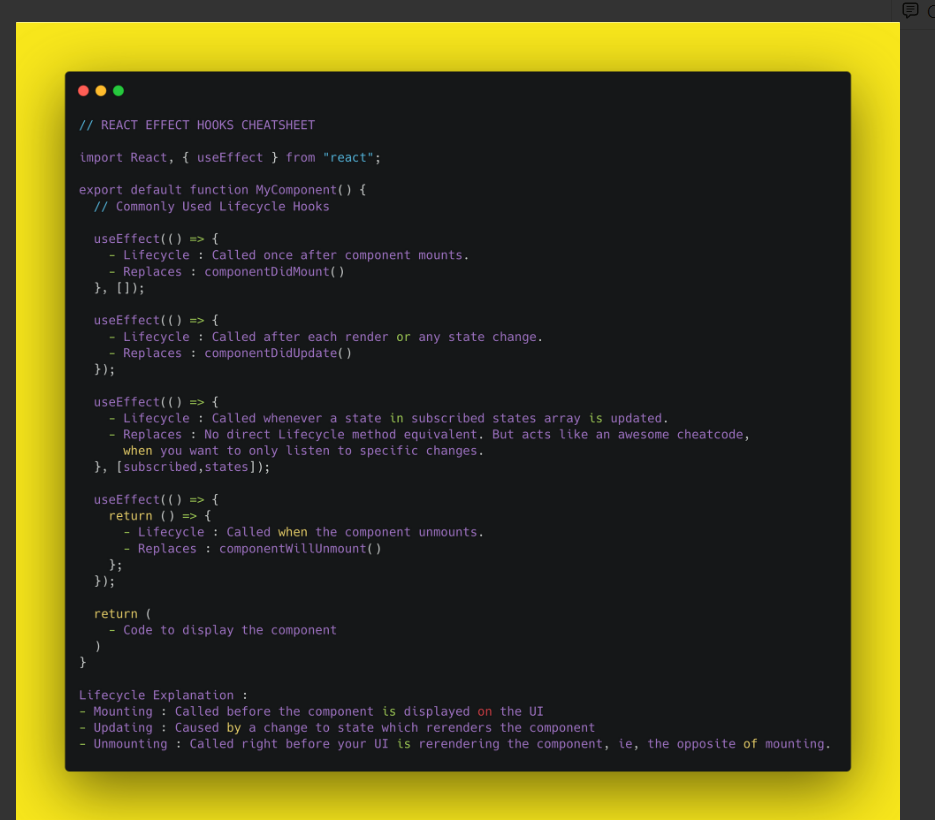

#  Table of contents
  
  
| No. | Questions                                                                                                                                         |
| --- | ------------------------------------------------------------------------------------------------------------------------------------------------- |
| 1   | [What is the closure](#what-is-the-closure )                                                                                                       |
| 2   | [What is a callback Function?](#what-is-a-callback-function )                                                                                      |
| 3   | [What is Promise?](#what-is-promise )                                                                                                              |
| 4   | [What do you understand by LocalStorage and sessionStorage?](#what-do-you-understand-by-localstorage-and-sessionstorage )                          |
| 5   | [What is Hoisting in Javascript?](#what-is-hoisting-in-javascript )                                                                                |
| 6   | [What are Higher Order Functions?](#what-are-higher-order-functions )                                                                              |
| 7   | [What is a anonymous function?](#what-is-a-anonymous-function )                                                                                    |
| 8   | [What are the first class functions in javaScript?](#what-are-the-first-class-functions-in-javascript )                                            |
| 9   | [How can We change class based components to fuctional based components](#how-can-we-change-class-based-components-to-fuctional-based-components ) |
| 10  | [Javascript map filter reduce. ](#javascript-map-filter-reduce )                                                                                   |
| 11  | [What is JSX? ](#what-is-jsx )                                                                                                                     |
| 12  | [What are keys in react? ](#what-are-keys-in-react )                                                                                               |
| 13  | [What is the difference between Virtual DOM and Real DOM? ](#what-is-the-difference-between-virtual-dom-and-real-dom )                             |
| 14  | [Major features of react. ](#major-features-of-react )                                                                                             |
| 15  | [What is components in react? ](#what-is-components-in-react )                                                                                     |
| 16  | [States in react? ](#states-in-react )                                                                                                             |
| 17  | [Props in react? ](#props-in-react )                                                                                                               |
| 18  | [Prop drilling in react? ](#prop-drilling-in-react )                                                                                               |
| 19  | [How to pass data between React component? ](#how-to-pass-data-between-react-component )                                                           |
| 20  | [What are higher order components in react? ](#what-are-higher-order-components-in-react )                                                         |
| 21  | [Techniques to optimize react app performance ](#techniques-to-optimize-react-app-performance )                                                    |
  
1. ### What is the closure?
  
    A Closure is the combination of functions bundled together with references to its surrounding state ( lexical environment ).
    In other words, a closure gives you access to an outer function's scope from an inner function.
  
    - functions in JavaScript form closures.
  
    ```javascript
    function firstFunc() {
    	let name = "javaScript"; // name is a local variable created by firstFunc
    	function secondFunc() {
    		// secondFunc() is the inner function, a closure
    		console.log(name); // use variable declared in the parent function
    	}
    	return secondFunc;
    }
    const myFunc = firstFunc();
    myFunc();
    ```
  
**[⬆ Back to Top ](#table-of-contents )**
  
2. ### What is a callback Function?
  
    A callback function is a function is passed as an argument to another function and invoked inside the parent function.
  
    ```javascript
    function parentFunc(callback) {
    	setTimeout(() => {
    		callback();
    	}, 1000);
    }
  
    function childFunc() {
    	console.log("Namaste World!");
    }
  
    parentFunc(childFunc);
    ```
  
**[⬆ Back to Top ](#table-of-contents )**
  
3. ### What is promise?
  
    A Promise is an object representing the eventual completion or failure of an asynchronous operation.
  
    ```javascript
    new Promise((resolve, reject) => {
    	console.log("initial");
    	resolve("resolved");
    })
    	.then((value) => {
    		console.log(value);
    		throw new Error("Something failed");
    		console.log("Do Something");
    	})
    	.catch((err) => console.error(err))
    	.then(() => console.log("Do this no matter what is happenig above"));
    ```
  
**[⬆ Back to Top ](#table-of-contents )**
  
4. ### What do you understand by LocalStorage and sessionStorage?
  
    localStorage is read only propery of the window interface allows you to access a storage object for the document's origin.
  
    - localStorage data has no expiration time.
  
    ```javascript
    // Save data to localStorage
    localStorage.setItem("key", "value");
  
    // Get saved data from localStorage
    let data = localStorage.getItem("key");
  
    // Remove saved data from localStorage
    localStorage.removeItem("key");
  
    // Remove all saved data from localStorage
    localStorage.clear();
    ```
  
    The read-only sessionStorage property accesses a session Storage object for the current origin.
  
    - data in sessionStorage is cleared when the page session ends.
  
    ```javascript
    // Save data to sessionStorage
    sessionStorage.setItem("key", "value");
  
    // Get saved data from sessionStorage
    let data = sessionStorage.getItem("key");
  
    // Remove saved data from sessionStorage
    sessionStorage.removeItem("key");
  
    // Remove all saved data from sessionStorage
    sessionStorage.clear();
    ```
  
**[⬆ Back to Top ](#table-of-contents )**
  
5. ### What is Hoisting in Javascript?
  
    JavaScript Hoisting refers to the process whereby the interpreter appears to move the declaration of functions, variables or classes to the top of their scope, prior to execution of the code.
  
    ```javascript
    //we can invoke function before it declared
    myFunc();
  
    function myFunc() {
    	console.log("Function are hoisted in Nature");
    }
  
    console.log(a); // undefined
    //only declarations are hoisted not initialization
    var a = 12;
    ```
  
**[⬆ Back to Top ](#table-of-contents )**
  
6. ### What are Higher Order Functions?
  
    A function that returns a function or takes other functions as arguments is called a higher-order function.
  
    ```javascript
    let radius = [12, 13, 14]; //radius of circles
  
    const area = function (radius) {
    	return Math.PI * radius * radius;
    };
  
    const output = function (array, logic) {
    	const output = [];
    	for (let i = 0; i < array.length; i++) {
    		output.push(logic(array[i]));
    	}
    	return output;
    };
  
    console.log(output(radius, area)); //we are passing area function to output
    ```
  
**[⬆ Back to Top ](#table-of-contents )**
  
7. ### What is a anonymous function?
  
    Function without a names is called a anonymous function.
  
    ```javascript
    var func = function () {}; //this is a anonymous function
    func();
    ```
  
**[⬆ Back to Top ](#table-of-contents )**
  
8. ### What are the first class functions in javaScript?
  
    A function is said to be first class function when they treated like variable.
  
    - Ability to used functions as variables.
  
    ```javascript
    function sayHello() {
    	return "Hello";
    }
  
    function greetings(helloMSG, name) {
    	return helloMSG() + name;
    }
  
    greetings(sayHello, " Aditya");
    ```
  
**[⬆ Back to Top ](#table-of-contents )**
  
9. ### How can We change class based components to fuctional based components?
  
    ```javascript
    // creation of state in class based components
    class classComponent {
       constructor(){
    	this.state = {
         name = '',
       }}
    componentDidMount(){
       // Mounting: // called before the componnet is displayed on the  UI
     }
    componentDidUpdate(){
       // caused by a change to state which rerenders the component
  
    };
    render(){
       return jsx;
    }
    }
  
    * Functional Component*
    //creation of state in functional based components
    import React, {useState} from 'react';
    function funcComponent(){
       const [name,setName] = useState('');
       useEffect(()=>{
          return // called right before your UI is rendering the component
       },
       []// runs on updating
       ) // replaces componentDidMount() and componentDidUpdate
  
    return jsx;
    }
    ```
  
    <a href ="notion.so/akashjdotcom/React-Project-Swipe-File/cb88a73845f24b2e9a88590a2cbf5316">
    
    </a>
    
  
**[⬆ Back to Top ](#table-of-contents )**
  
10. ### Explain Javascript map, filter and reduce function.
  
    .map iterates with a callback function each element of the array and creates a new array.
  
    ```javascript
    let array = [12, 13, 14, 15, 16];
    array.map((item, index, array) => {
    	return item * 2;
    });
  
    // Output [24, 26, 28, 30, 32]
    ```
  
    .filter method returns a new array with elements that pass that functions condition.
  
    ```javascript
    let array = [12, 13, 18, 20, 25];
    array.filter((item) => item > 18);
  
    // output [20, 25]
    ```
  
    .reduce method returns a single value, the functions accumulated result.
  
    ```javascript
    let array = [20, 25, 20, 25];
    //Basic Syntax
    // array.reduce((acc, currValue, index, array) => {
    // acc + currValue;
    //}initialValue);
  
    array.reduce((acc, currValue, index, array) => acc + currValue, 0);
    // output 90
    ```
  
**[⬆ Back to Top ](#table-of-contents )**
  
11. ### What is JSX?
  
    JSX is a XML-like syntax extension to ECMAScript (the acronym stands for JavaScript XML). Basically it just provides syntactic sugar for the React.createElement() function, giving us expressiveness of JavaScript along with HTML like template syntax.
  
    ```javascript
    const element = <h1>Hello, world!</h1>;
    ```
  
**[⬆ Back to Top ](#table-of-contents )**
  
12. ### What are keys in react?
  
    A “key” is a special string attribute you need to include when creating lists of elements in React. Keys are used in React to identify which items in the list are changed, updated, or deleted. In other words, we can say that keys are used to give an identity to the elements in the lists.
  
**[⬆ Back to Top ](#table-of-contents )**
  
13. ### What is the difference between Virtual DOM and Real DOM?
  
    _Real DOM_
  
    1. DOM manipulation is very expensive.
    2. There is too much memory wastage.
    3. It updates Slow.
    4. It can directly update HTML
    5. Creates a new DOM if the element updates.
  
    _Virtual DOM_
  
    1. DOM manipulation is very easy
    2. No memory wastage
    3. It updates fast
    4. It can’t update HTML directly
    5. Update the JSX if the element update
  
**[⬆ Back to Top ](#table-of-contents )**
  
15. ### What is components in react?
  
    Components are independent and reusable bits of code. They serve the same purpose as JavaScript functions, but work in isolation and return HTML.
  
    Components come in two types, Class components and Function components.
  
**[⬆ Back to Top ](#table-of-contents )**
  
16. ### States in react?
  
    _State_ of a component is an object that holds some information that may change over the lifetime of the component. We should always try to make our state as simple as possible and minimize the number of stateful components.
  
    State is similar to props, but it is private and fully controlled by the component ,i.e., it is not accessible to any other component till the owner component decides to pass it
  
**[⬆ Back to Top ](#table-of-contents )**
  
17. ### Props in react?
  
    Props are arguments passed into React components.
  
    Props are passed to components via HTML attributes.
  
    ```javascript
    const myElement = <Car brand='Ford' />;
  
    //Using the brand props
    function Car(props) {
    	return <h2>I am a {props.brand}!</h2>;
    }
    ```
  
**[⬆ Back to Top ](#table-of-contents )**
  
18. ### Prop drilling in react?
  
    Prop drilling is basically a situation when the same data is being sent at almost every level due to requirements in the final level. Here is a diagram to demonstrate it better. Data needed to be sent from Parent to ChildC.
  
    
  
**[⬆ Back to Top ](#table-of-contents )**
  